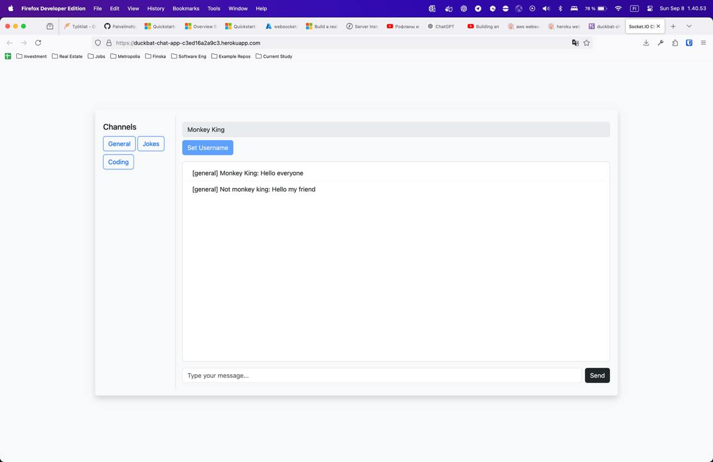
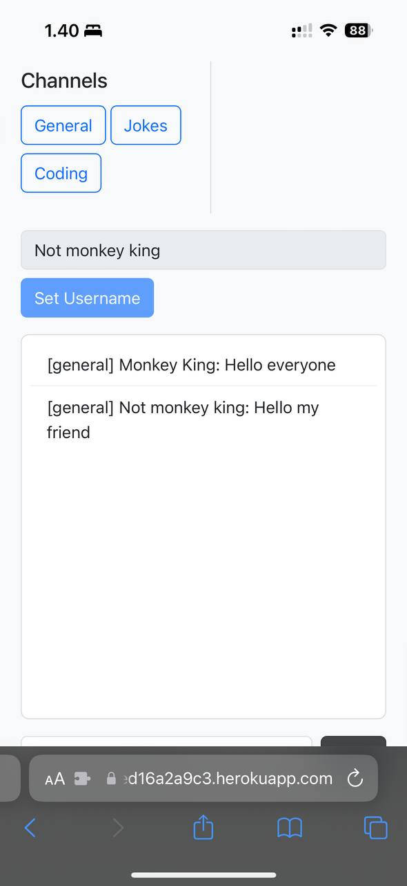

# Web real time Chat application 

- Visit application:
https://duckbat-chat-app-c3ed16a2a9c3.herokuapp.com/ 

## Tech Stack:
- JavaScript
- Express.JS
- Socket.IO
- Bootstrap
- Heroku

## App Functionality
- Websocket implementation
- Setting username
- Write to chat and different chat rooms
- View real time chat and different chat rooms
- Visit different chat rooms on choice
- Bootstrap implementation and tuned with vanilla css for visuals 

## App creation steps
1.	Creating Basic Chat Functionality:
- Started with Socket.IO documentation to establish a real-time connection between server and clients.
2.	Implementing Username Management:
- Added functionality for users to set usernames, which are stored on the server to manage user identities during chat sessions.
3.	Room-Specific Chats:
- Introduced chat rooms that isolate messages per room, saving chat history for each room.
4.	Joining and Managing Rooms:
- Developed mechanisms for users to join different rooms and automatically load the chat history.
5.	UI Development:
- Integrated Bootstrap for basic styling and layout, enhancing the visuals with additional custom CSS for a polished appearance.
6. Deployment:
- Modified code host and deployed on Heroku and created a Procfile for correct enviroment run for it.

### Demo screenshots
## Screenshot apps when the server was active

- Desktop version

- Mobile version

